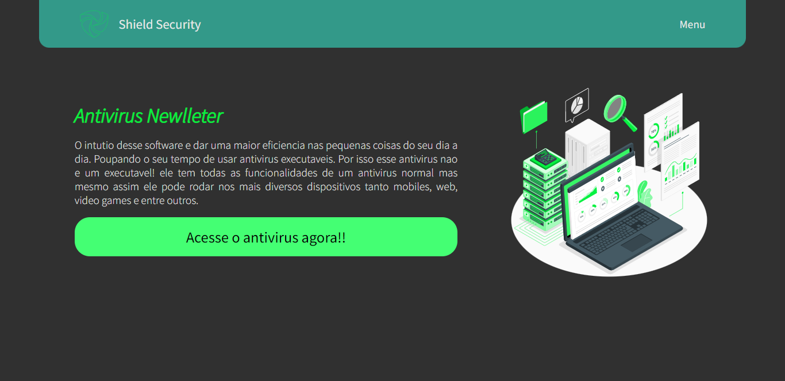

# Projeto Shield Security

Projeto construido para uma avaliação bimestral de projeto de vida no 1º ano meidio no Sistema Educacional Loide Martha. A proposta do trabalho e criar uma startup e desenvolver alguns projetos sobre ela, e esse e um desses

 [🔗 Clique aqui para acessar](https://shieldsecurity.vercel.app)

## 🛠 Tecnologias

 - Next.js
 - Figma
 - React 
 - TypeScript
 - Radix e Mui
